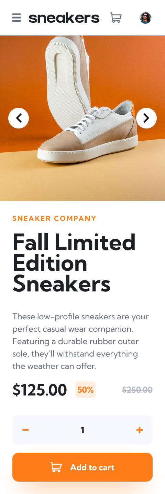
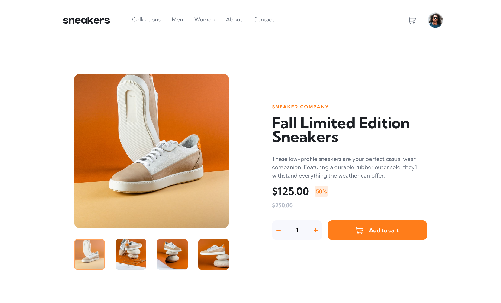

# Frontend Mentor - E-commerce product page solution

This is my solution to the [E-commerce product page challenge on Frontend Mentor](https://www.frontendmentor.io/challenges/ecommerce-product-page-UPsZ9MJp6).

## Table of contents

- [Overview](#overview)
  - [The challenge](#the-challenge)
  - [Screenshots](#screenshot)
  - [Links](#links)
- [My process](#my-process)
  - [Built with](#built-with)
  - [What I learned](#what-i-learned)
- [Author](#author)

## Overview

### The challenge

I have created my solution using typescript, preact and tailwindcss. This was the first time that I used all of these technologies for a project, so it was a valuable learning experience for me.

### Screenshots

### Links

- Solution URL: [https://www.frontendmentor.io/](https://www.frontendmentor.io/)
- Live Site URL: [https://ecommerce-app-delta-five.vercel.app/](https://ecommerce-app-delta-five.vercel.app/)

## My process

### Built with

- [Preact](https://preactjs.com/) - Preact Framework
- [TailwindCSS](https://tailwindcss.com/) - Tailwind CSS

### What I learned

**TailwindCSS:** I found this to be a very interesting way to use css. Compared to writing css in the traditional way, it seemed to create more ‘messy’ code, but it also felt like it allowed me to work faster and more efficiently.

**Preact:** This was only the second time that I used a modern js framework for a project, previously I had created one small project with next.js. I decided to choose preact over react for this project because I wanted to have a smaller bundle size for my page, but I also faced some challenges because the online resources for preact were not as plentiful as for react. Next time, I need to think more carefully about the structure of my components before I start implementing them, to avoid having to refactor them at different stages of my project development.

### Continued development

For my next project I would like to learn more about:

- Git: I know the basics but need to learn more about branching and merging.
- Preact/react: Create a full project using one of these without a framework like next.js.

## Author

- Frontend Mentor - [@TomL](https://www.frontendmentor.io/profile/TomL)
